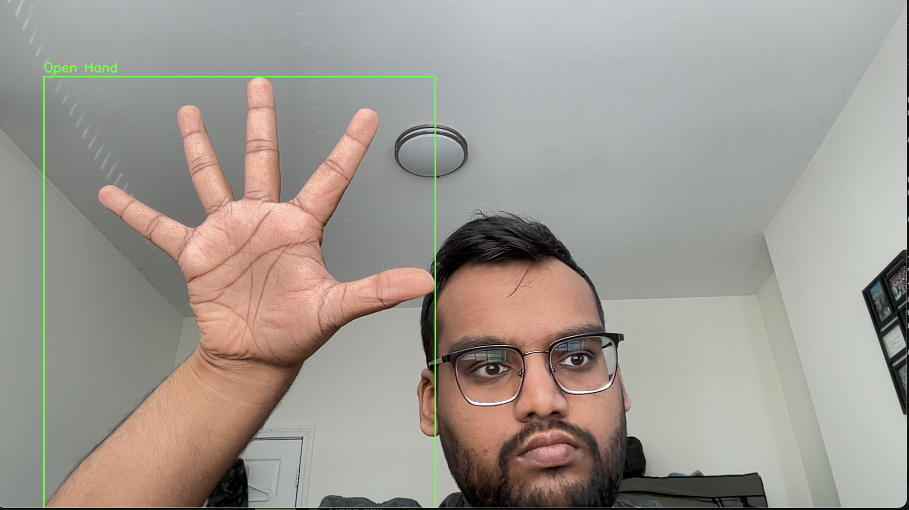
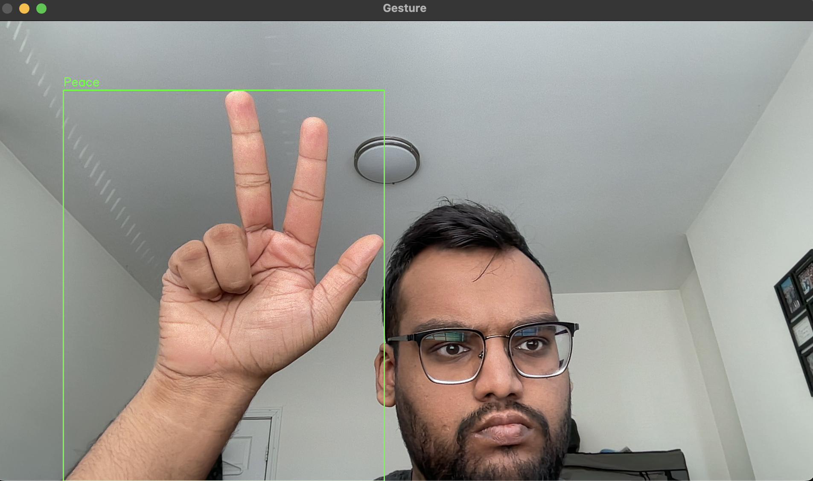

# Hand Gesture Recognition using OpenCV

This project is part of the **CAS CS 585 - Spring 2024** course assignment, where we designed and implemented algorithms to recognize hand shapes and gestures. The recognized gestures trigger a corresponding graphical display.

## Table of Contents
- [Overview](#overview)
- [Learning Objectives](#learning-objectives)
- [Features](#features)
- [Algorithms & Techniques](#algorithms--techniques)
- [Installation](#installation)
- [Usage](#usage)
- [Results](#results)
- [Experiments](#experiments)
- [Discussion](#discussion)
- [Future Work](#future-work)
- [Credits](#credits)
- [License](#license)

## Overview
This project implements a real-time hand gesture recognition system using OpenCV. It recognizes various hand gestures, such as an open hand, fist, pointing, and peace sign, and provides a graphical response to these gestures.

## Learning Objectives
- **Read and display video frames** from a webcam.
- **Tracking by template matching** and analyzing object properties.
- **Binary object shape analysis** and gesture recognition.
- **Interactive graphical applications** in response to recognized gestures.

## Features
- **Skin Detection:** Isolates skin regions in the video feed.
- **Hand Contour Detection:** Identifies the largest contour in the frame as the hand.
- **Feature Extraction:** Uses convexity defects and geometric analysis to extract features like finger count and thumb detection.
- **Gesture Recognition:** Classifies hand shapes into predefined gestures and displays corresponding graphical feedback.

## Algorithms & Techniques
This project utilizes several computer vision techniques, including:
- **Skin Detection** using HSV color space.
- **Contour Detection** for identifying hand shapes.
- **Convexity Defects Analysis** to recognize gestures.
- **Geometric Analysis** for finger counting and thumb detection.

## Installation
To run this project, you'll need Python 3.x and the following libraries:

```bash
pip install opencv-python numpy
```

## Usage
Clone the repository and run the `main.py` script to start the gesture recognition system:

```bash
git clone https://github.com/yourusername/hand-gesture-recognition.git
cd hand-gesture-recognition
python code/main.py
```

Press `q` to exit the program.

## Results

Here are some screenshots showcasing the system in action:

### Example 1: Recognizing an Open Hand Gesture


### Example 2: Recognizing a Peace Sign Gesture


- **Accuracy:** 74%
- **F1 Score:** 0.741
- **Precision:** 0.803
- **Recall:** 0.740

### Confusion Matrix
| Predicted \ Actual | Fist | Open Hand | Pointing | Peace | Unknown |
|--------------------|------|-----------|----------|-------|---------|
| Fist               | 8    | 0         | 0        | 0     | 2       |
| Open Hand          | 0    | 6         | 0        | 1     | 3       |
| Pointing           | 1    | 0         | 6        | 2     | 1       |
| Peace              | 2    | 0         | 0        | 7     | 1       |
| Unknown            | 0    | 0         | 0        | 0     | 10      |

## Experiments
The project underwent several experimental phases:
1. **Initial Approach:** Circularity and Aspect Ratio Analysis.
2. **Template Matching:** Tried but eventually abandoned due to variability.
3. **Convexity Analysis:** Key for recognizing finger-based gestures.
4. **Thumb Detection:** Integrated to improve the accuracy of gesture recognition.

## Discussion
### Strengths
- **Robust Gesture Recognition:** Based on convexity defects and thumb detection.
- **Real-time Processing:** Efficient and responsive graphical feedback.

### Weaknesses
- **Limited Gesture Set:** Currently recognizes only four gestures.
- **Sensitivity to Hand Orientation & Lighting:** Accuracy drops with non-ideal conditions.

## Future Work
- **User-Centered Adaptation:** Custom calibration for individual users.
- **Deep Learning Approaches:** Explore CNNs for broader gesture recognition.
- **Improved Hand Tracking:** Enhance robustness to occlusions and varying orientations.

## Credits
- **Instructor:** Margrit Betke, Professor, Computer Science Department, BU
- **Team:** Uday Garg (U11302797)
- **Resources:** 
  - [OpenCV Documentation](https://docs.opencv.org/4.x/index.html)
  - [Class Notes](https://www.cs.bu.edu/faculty/betke/cs585/open/2024-cs585-projections-localization-floodfill-Jan25.pdf)

## License
This project is licensed under the MIT License - see the [LICENSE](LICENSE) file for details.
